----
marp: true
author: Ruslan Edokov
size: 4:3
color: Black
footer:  Пишем документы как код
header: INFOSTART TEAM EVENT 2026

----

<!-- class: lead -->

# План

* Что мы делаем с помощью подхода "Документа как код"?
* Что это дает?
* Подробнее про используемые инструменты
* Рисуем схему процесса
* Делаем макет интерфейса
* Составляем документ для заказчика

----

# Что мы делаем с помощью подхода "Документа как код"?

## Макеты интерфейса

* Отдельный диалект salt языка PlantUML
* Используем для прототипирования и согласования интерфейса с заказчиком

----

# Что мы делаем с помощью подхода "Документа как код"? 2

## Схемы процессов

* При описании процессов мы используем нотацию eEPC
* Нам пришлось разработать свой стиль, чтобы соответствовать нотации
* Система сама размещает элементы на схеме и тонкое управление местоположением элемента требует практики, а иногда невозможно. Это надо принять

----

# Что мы делаем с помощью подхода "Документа как код"? 3

## Прочие схемы

* Использование нетипичных обозначений требует времени на их добавление
* У нас сложился набор наиболее часто используемых. Их мы добавили в шаблон

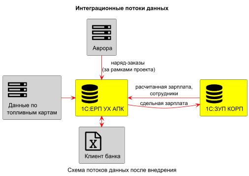

----

# Что это дает?

----

# Найдите отличие

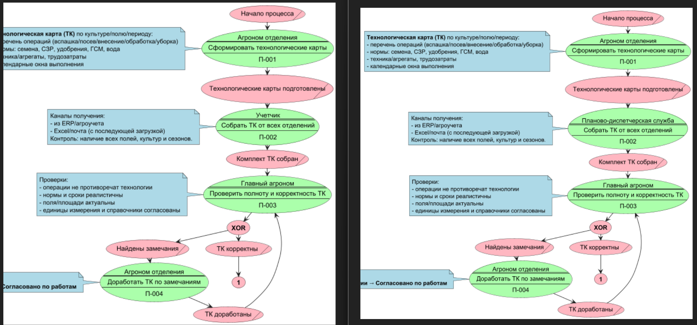

----

# Нашли?

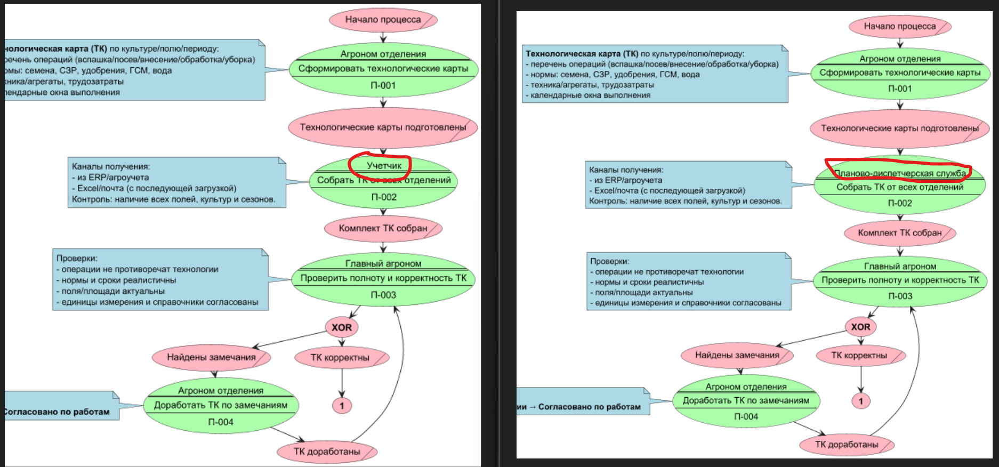

----

# А так удобнее?

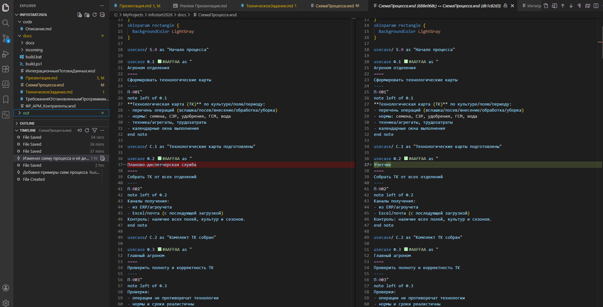

----

# Подробнее про используемые инструменты

* Для разработки документов мы используем VS Code
  * Markdown - для разработки текстовых документов и несложных презентаций
  * PlantUML - для отрисовки схем процессов, макетов интерфейса и прочих схем
* Git - хранит версии наших документов
* Pandoc - используем для преобразования Markdown в формат MS Word docx

----

# Рисуем схему процесса

----

# Шаблоны и сниппеты

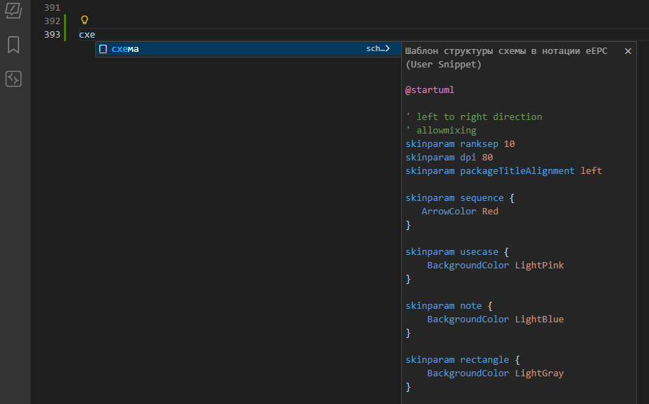

----

# Генерируем файлы схем, когда готовы

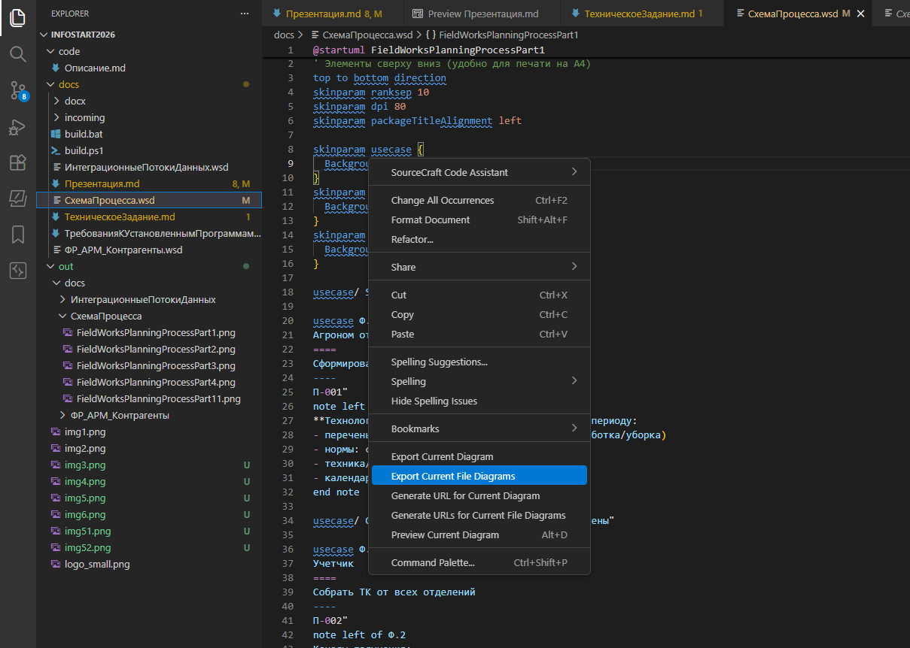

----

# Делаем макет интерфейса

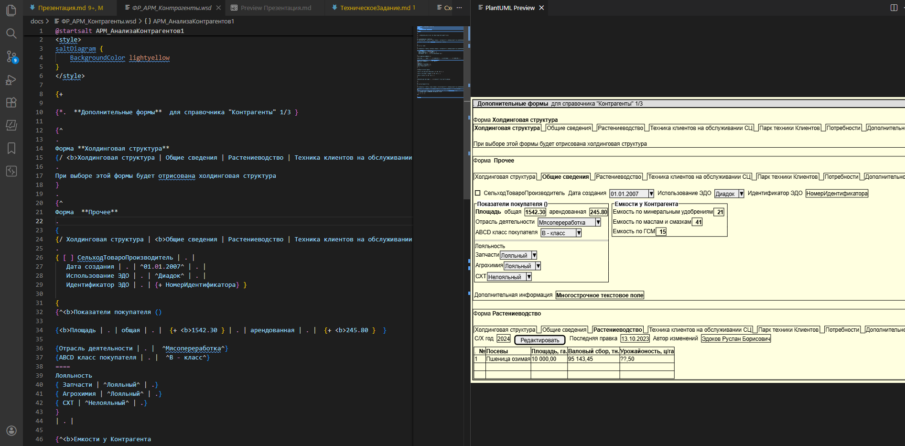

----

# На помощь приходят нейронки

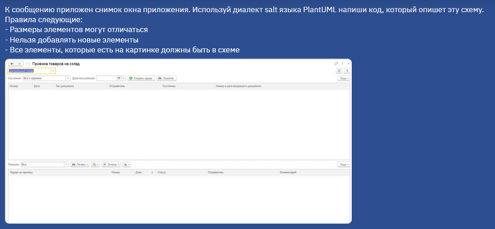

----

# Результат работы ChatGPT

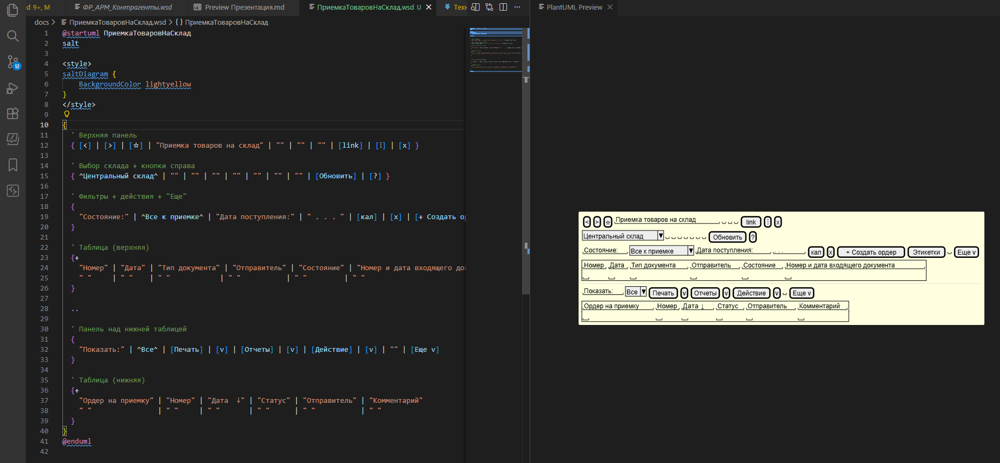

----

# Составляем документ для заказчика

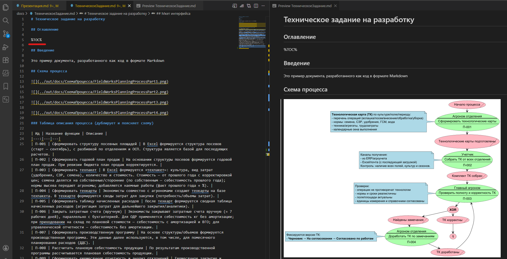

----

# Схемы и интерфейсы вставляются как картинки

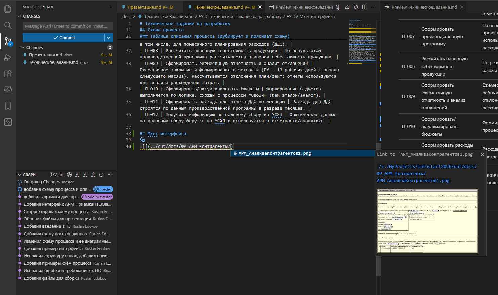

----

# Внутри команды разработки можно использовать только Markdown

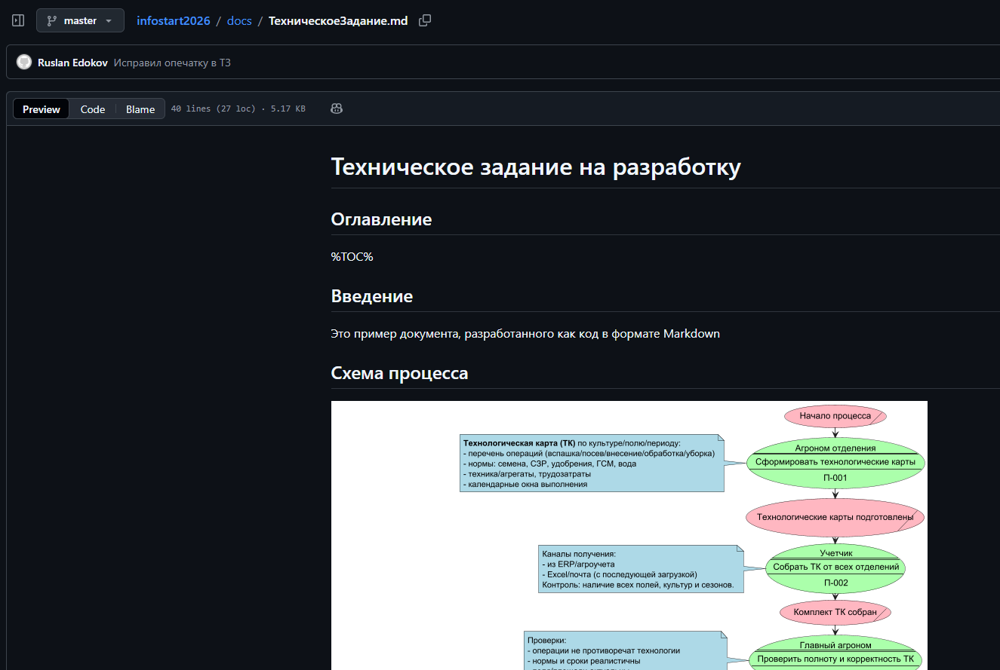

----

# Собираем документ для заказчика. Этапы сборки

* Получить последние редакции всех документов: git pull
* Запустить сборочный скрипт build.bat
* Отредактировать получившийся файл docx

----

# Запустить сборочный скрипт

* Автоматически проверяется целостность ресурсов

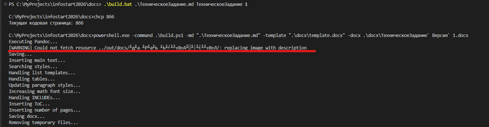

----

# Редактирование получившегося файла docx

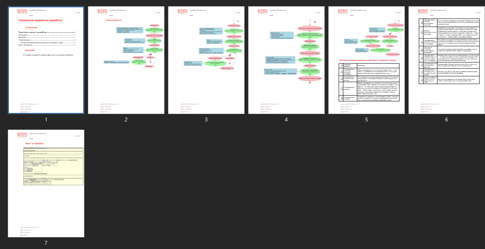

----

----

# Чего сейчас нет, но надо добавить

* Примеры почему сразу не редактировать в MS Word (в начало презентации добавить)
* Почему не гуглдок
* Как отрабатываем замечания заказчика
* Достоинства и недостатки подхода вкратце на одном слайде
* Какие сложности в освоении аналитиками и как их решать

