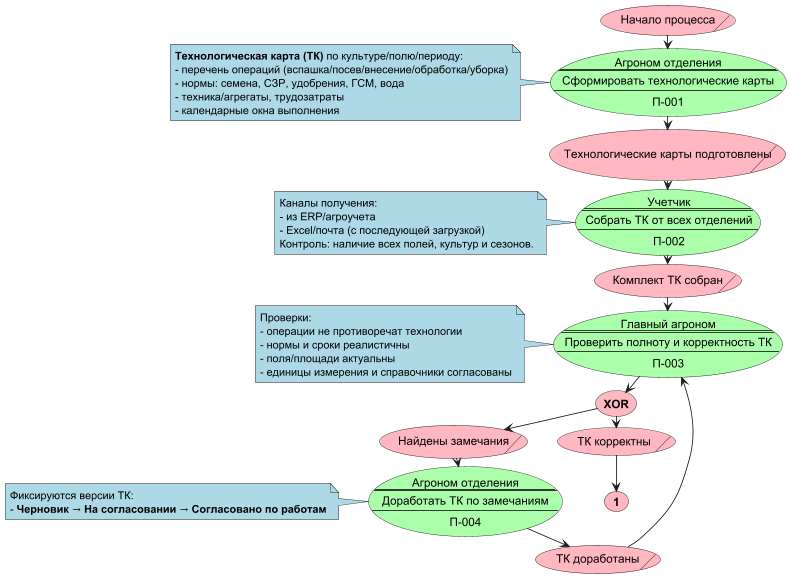
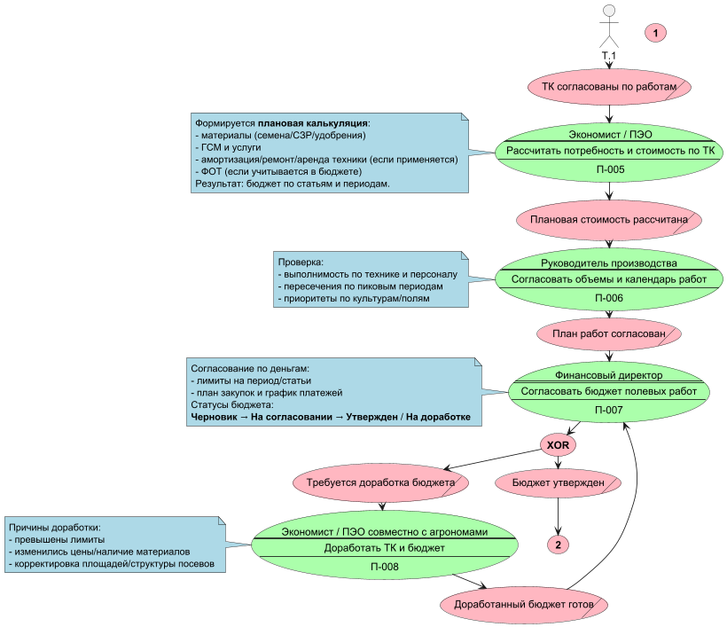
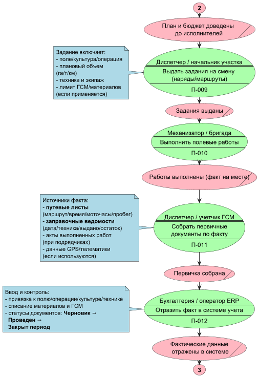
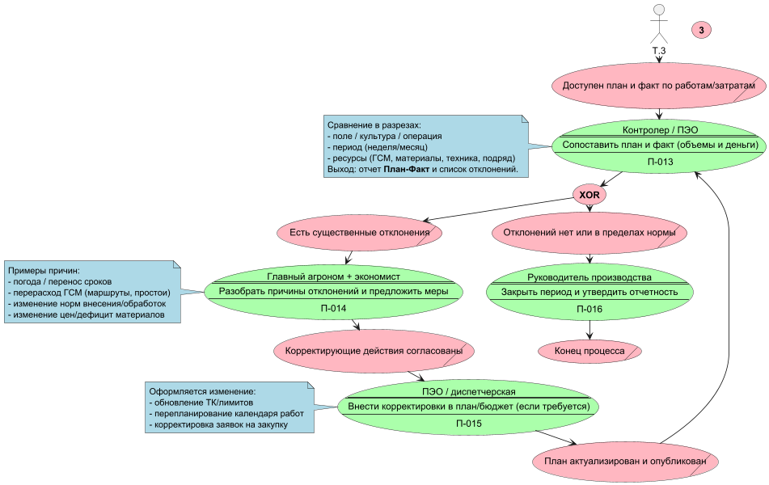
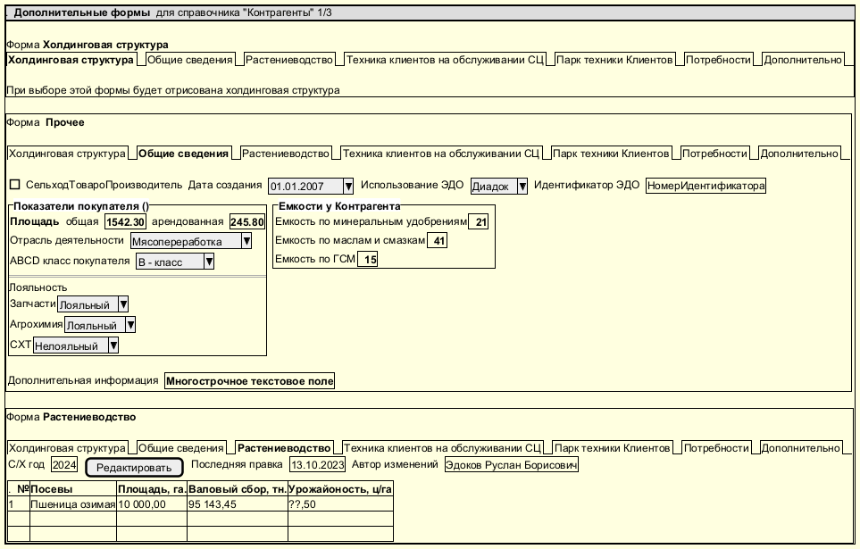

# Техническое задание на разработку

## Оглавление

%TOC%

## Введение

Это пример документа, разработанного как код в формате Markdown

## Схема процесса

### Таблица описания процесса (дублирует и поясняет схему)

| Ид | Название функции | Описание |
|---:|---|---|
| П-001 | Сформировать структуру посевных площадей | В Excel формируется структура посевов (старт — сентябрь), с разбивкой по отделениям и ОСП. Структура является базой для последующих расчетов. |
| П-002 | Сформировать годовой план продаж | На основании структуры посевов формируется годовой план продаж. При ревизии бюджета план продаж корректируется. |
| П-003 | Сформировать техпакет | В Excel формируется «техпакет»: культура, вид затрат (удобрения, СЗР, семена), количество и стоимость. Стоимость — от прошлого года с корректировкой цен; семена делятся на собственные/сторонние (по собственным — себестоимость прошлого года); нормы высева передают агрономы; добавляются наемные работы (факт прошлого года + %). |
| П-004 | Сформировать техкарты | Экономисты совместно с агрономами создают техкарты на базе техпакета. В техкарте формируются своды затрат для закупки (потребность/объемы затрат). |
| П-005 | Сформировать таблицу начисленных расходов | После техкарт формируется сводная таблица начисленных расходов (агрегация затрат для дальнейшего закрытия/аналитики). |
| П-006 | Закрыть затратные счета (вручную) | Экономисты закрывают затратные счета вручную (≈ 7 рабочих дней), параллельно с бухгалтерией. Для ОДР применяется себестоимость кг без амортизации; при приходовании на склад по плановой стоимости — себестоимость с амортизацией и ВГО; для управленческой отчетности — себестоимость без амортизации. |
| П-007 | Сформировать производственную программу | На основе структуры/объемов формируется производственная программа. Эти данные далее используются, в том числе, для помесячного планирования расходов (ДДС). |
| П-008 | Рассчитать плановую себестоимость продукции | По результатам производственной программы рассчитывается плановая себестоимость продукции. |
| П-009 | Сформировать ежемесячную отчетность и анализ отклонений | Ежемесячное закрытие и формирование отчетности (БУ — 10 рабочих дней с начала следующего месяца). Рассчитываются отклонения план/факт; отчеты используются для анализа расхождений затрат. |
| П-010 | Сформировать/актуализировать бюджеты | Формирование бюджетов выполняется по логике, схожей с процессом «Овощи» (как эталон/аналог). |
| П-011 | Сформировать расходы для отчета ДДС по месяцам | Расходы для ДДС строятся по данным производственной программы в разрезе месяцев. |
| П-012 | Получить информацию по валовому сбору из УСХП | Фактические данные по валовому сбору берутся из УСХП и используются в отчетности/аналитике. |

## Макет интерфейса

